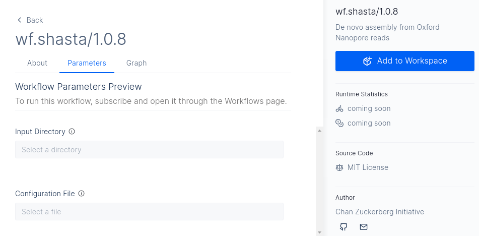

# Shasta workflow

## Workflow on [LatchBio](https://latch.bio)
Access here: https://console.latch.bio/explore/60363/info

## About Shasta
The goal of Shasta is to rapidly produce accurate assembled sequence using as input DNA reads generated by [Oxford Nanopore](https://nanoporetech.com) flow cells.

Computational methods used by the Shasta assembler include:

- Using a [run-length](https://en.wikipedia.org/wiki/Run-length_encoding) representation of the read sequence. This makes the assembly process more resilient to errors in homopolymer repeat counts, which are the most common type of errors in Oxford Nanopore reads.
- Using in some phases of the computation a representation of the read sequence based on markers, a fixed subset of short k-mers (k ≈ 10).

## Quickstart

1. Download input file (`fasta`) and configuration file (`conf`) from [here](https://mega.nz/folder/R1BmiJJI#YFdxk95m13tZJt-6YLDZMA)
2. Create an input directory on [dashboard](https://console.latch.bio/data) and upload your data
3. Add `wf.shasta` to your workspace from [here](https://console.latch.bio/explore/60363/info)
4. Go to your [workflows](https://console.latch.bio/workflows) and open `wf.shasta` tool
5. Provide the input directory where `fasta` file is uploaded and also select the `conf` file
6. Launch the workflow

## Links
- Configuration Presets: https://github.com/chanzuckerberg/shasta/tree/master/conf
- Source Code: https://github.com/chanzuckerberg/shasta
- Documentation: https://chanzuckerberg.github.io/shasta

## How to cite
- Paper: https://www.nature.com/articles/s41587-020-0503-6
- Acknowledgements to external packages: https://chanzuckerberg.github.io/shasta/Acknowledgments.html
